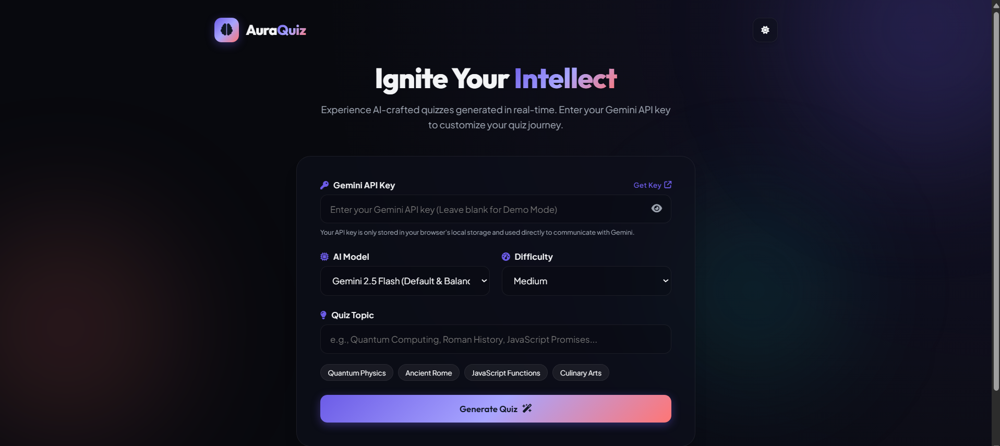
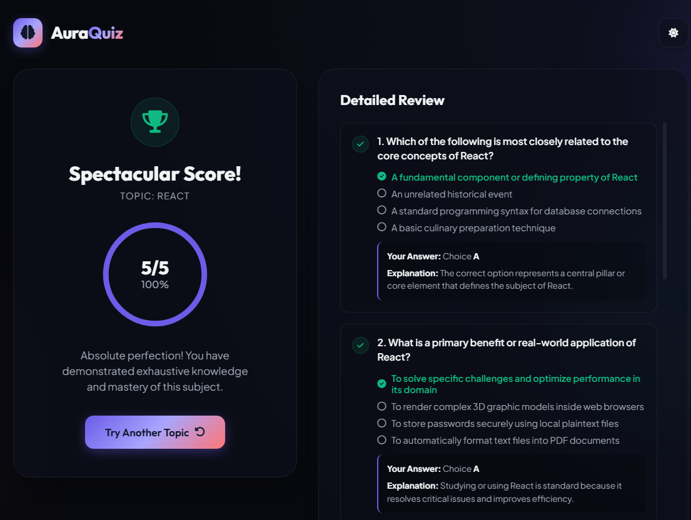

# 🧠 QuizMe — AI-Powered Quiz Generator

QuizMe is an interactive AI-powered quiz application that generates customized quizzes using the **Google Gemini API**.

Choose a topic and difficulty, answer AI-generated questions, use hints when needed, and review your performance at the end.

🔗 **Live Demo:** https://quizme-orpin.vercel.app/

---

## ✨ Features

* 🤖 AI-generated quizzes using Google Gemini
* 🎯 Generate quizzes based on any topic
* 📊 Multiple difficulty levels
* 💡 Hint system
* ⏱️ Timed questions
* 📝 Automatic scoring
* 📖 Review your answers after completing a quiz
* 🔄 Generate a new quiz
* 📴 Demo mode for trying the application without an API key
* 🔐 API key stored locally in the browser

---

## 🛠️ Technologies Used

<p align="center">
  
</p>

* HTML5
* CSS3
* JavaScript
* Google Gemini API
* Git & GitHub
* Vercel

---

## 🚀 How It Works

1. Enter your Google Gemini API key or use Demo Mode.
2. Select your preferred difficulty.
3. Enter a topic for your quiz.
4. Generate your quiz.
5. Answer the questions.
6. Use hints when needed.
7. Complete the quiz.
8. View your score and review your answers.
9. Generate another quiz and keep learning.

---


## 📸 Screenshots

### Quiz Interface

<p align="center">
  
</p>

---

### Quiz Results

<p align="center">
  
</p>


---

## 🔐 API Key & Privacy

QuizMe allows users to provide their own Google Gemini API key.

The API key is stored locally in the browser and is not included in the project source code.

> ⚠️ Never commit your API key to GitHub or share it publicly.

---

## 💻 Run Locally

### 1. Clone the repository

```bash
git clone https://github.com/abrahasin99/quizme.git
```

### 2. Open the project

```bash
cd quizme
```

### 3. Run the application

Open `index.html` in your browser.

No build tool or package installation is required.

---

## 📚 What I Learned

While building QuizMe, I practiced:

* DOM manipulation
* JavaScript fundamentals
* Event handling
* Fetch API
* Asynchronous JavaScript
* Working with REST APIs
* JSON data handling
* Dynamic UI rendering
* Local Storage
* Error handling
* Responsive web design
* API integration
* Deploying a web application

---

## 🔮 Future Improvements

* [ ] Add quiz history
* [ ] Add user accounts
* [ ] Add performance analytics
* [ ] Add more question types
* [ ] Add leaderboard
* [ ] Improve accessibility
* [ ] Add dark/light mode
* [ ] Add more customization options

---

⭐ If you found QuizMe useful or interesting, consider giving the repository a star!

<p align="center">
  <i>Learn. Build. Improve. 🚀</i>
</p>
